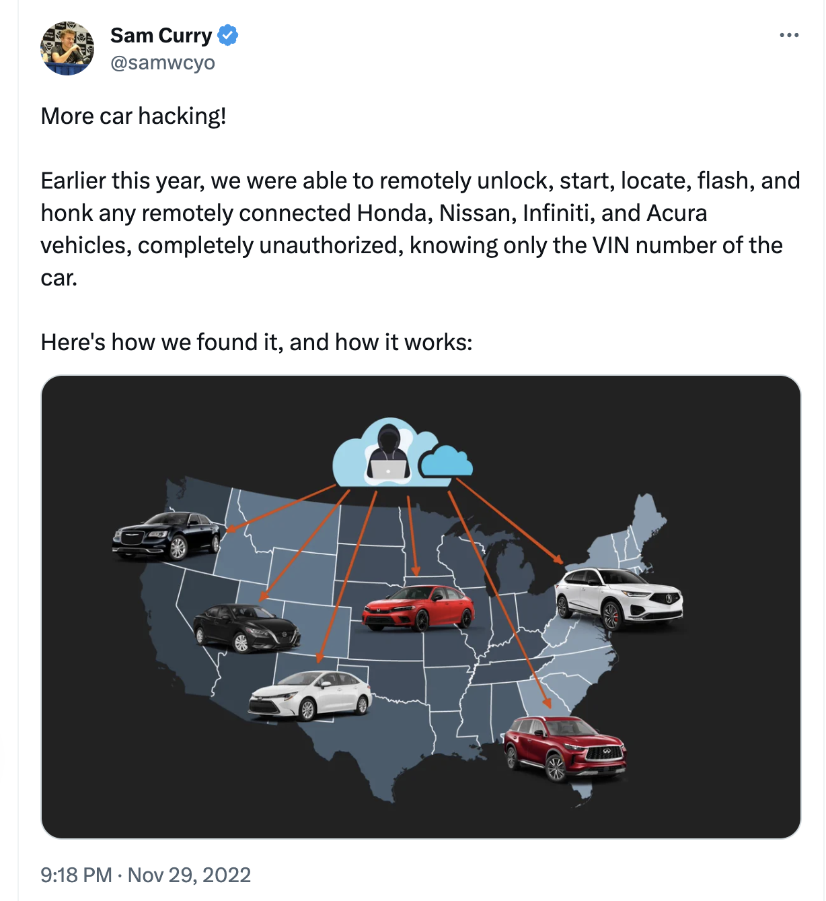

# Automobile industry web vulnerabilities demo

This project aims to illustrate a few of the auto industry web vulnerabilities [detailed in January 2023 by Sam Curry](https://samcurry.net/web-hackers-vs-the-auto-industry/) in his security blog, with reference to the [OWASP Top 10 API Security risks](https://owasp.org/API-Security/editions/2023/en/0x11-t10/).



The project consists of two repos:

- [auto-vulns-demo-frontend](https://github.com/mdorn/auto-vulns-demo-frontend)
- [auto-vulns-demo-backend](https://github.com/mdorn/auto-vulns-demo-backend)

These services are currently deployed on GCP. The UI is deployed at https://demo.mdorn.xyz/ and it accesses an API deployed to Cloud Run at https://auto-vulns-demo-backend-ammbvc27xa-uc.a.run.app

## Vulnerability #1: Hyundai/Genesis - takeover of remote control capabilities

https://twitter.com/samwcyo/status/1597695281881296897

In this case Curry and his team discovered they coudd take control of locks, engine, horn, headlights, and trunk of Hyundai and Genesis vehicles using only an email address belonging to the car's owner.

Discovery of the vulnerabilty entailed:

1) Inspecting traffic sent from the mobile app using Burp Proxy revealed a redundant specification of email address in request payload (i.e. why was the email address sent in the request when it was already encoded in the JWT used in the Authz header?). This suggested an avenue for manipulating server-side logic.
2) Fuzzing user input in an account registration form with Burp Intruder revealed a) validating email ownership was unnecessary (i.e. no confirmation email sent) and b) a faulty regex allowed control characters in the email address, so that an attacker could register a new account using the target victim's email address with a CRLF character on the end, which as it turned out the application would treat as equivalent to the victim's identity.

### Demo

To see this exploit in action:

Login to https://demo.mdorn.xyz/ as `hyundai.owner@gmail.com` pwd: `3x@mple#pwd`. Click "Unlock car".  The request succeeds presumably because the email in the request matches the email in the JWT.

Examine the API request being sent to https://auto-vulns-demo-backend-ammbvc27xa-uc.a.run.app/api/v2/rcs/rdo/unlock  Using the valid JWT as the `Authorization` header.  Attempt to manipulate the payload to use someone else's account.

Valid payload succeeds:

```json
{"userName":"other.hyundai.owner@gmail.com","vin":"4Y1SL65848Z411439"}
```

Invalid payload fails:

```json
{"userName":"other.hyundai.owner@gmail.com","vin":"4Y1SL65848Z411439"}
```

An attacker has registered `hyundai.owner%0d@gmail.com` and can use this to gain control over the victim's account.  Use this account with the same password as the victim user to see it in action.

The attacker's payload succeeds:

```json
{"userName":"hyundai%0d.owner@gmail.com","vin":"4Y1SL65848Z411439"}
```

### Remediation suggestions

In OWASP terms, this vulnerability might be described as a combination of API1:2023 Broken Object Level Authorization and API3:2023 Broken Object Property Level Authorization. The application failed to ensure that only the legitimate account owner could access vehicle functionality, and part of the exploit involved manipulating a property in the payload that was unnecessarliy exposed (user ID/email).

Additionally we see an aspect of API2:2023 Broken Authentication at the user registration level where usernames were not fully validated.

In the demo implementation, even when an industrial strength IAM solution like Okta is used, not properly validating API calls can have secure consequences.  App developers should reduce the attack service by ensuring input is restricted to the minimal data needed and that user input is thoroughly validated.

## Vulnerability #2: 

https://twitter.com/samwcyo/status/1597792097175674880

In this case Curry and his team were able to remotely unlock, start, locate, flash, and honk any remotely connected Honda, Nissan, Infiniti, and Acura vehicle **with only a VIN number -- no authorization needed.**

TODO

## Vulnerability #3

https://samcurry.net/web-hackers-vs-the-auto-industry/ - see item #4

In this case Curry and his team were able to fully takeover Fleet Management Systems that covered more than 15 million connected vehicles, including police and fire departments, including identifying GPS locations and remote capabilities like disabling starters.

TODO

### Demo

https://demo.mdorn.xyz/login.html

Valid login: `admin / s3cr3t`

Example SQL injection that bypasses ModSecurity core ruleset `admin '--`
